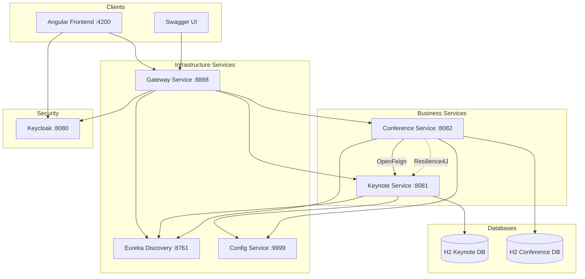

# Gestion de Conférences - Architecture Microservices

## Description du Projet

Application de gestion de conférences et d'intervenants (Keynotes) basée sur une architecture microservices.

## Architecture Technique



## Stack Technique

| Composant | Technologie |
|-----------|-------------|
| Backend | Java 17 / Spring Boot 3.2.x |
| Architecture | Microservices avec Maven |
| Gateway | Spring Cloud Gateway |
| Discovery | Eureka Server |
| Configuration | Spring Cloud Config |
| Communication Inter-services | OpenFeign |
| Frontend | Angular 17+ |
| Sécurité | OAuth2 / OIDC avec Keycloak |
| Documentation API | OpenAPI (Swagger) |
| Tolérance aux pannes | Resilience4J |
| Déploiement | Docker / Docker Compose |
| Base de données | H2 (In-memory) |

## Services

### Services d'Infrastructure

| Service | Port | Description |
|---------|------|-------------|
| Discovery Service | 8761 | Eureka Server - Registre des services |
| Config Service | 9999 | Serveur de configuration centralisée |
| Gateway Service | 8888 | Point d'entrée unique (API Gateway) |

### Services Métiers

| Service | Port | Description |
|---------|------|-------------|
| Keynote Service | 8081 | Gestion des intervenants |
| Conference Service | 8082 | Gestion des conférences et reviews |

### Services Externes

| Service | Port | Description |
|---------|------|-------------|
| Keycloak | 8080 | Serveur d'authentification OAuth2/OIDC |
| Angular App | 4200 | Interface utilisateur web |

## Structure du Projet

```
keynote/
├── pom.xml                    # Parent Maven POM
├── discovery-service/         # Eureka Server
├── config-service/            # Spring Cloud Config
├── gateway-service/           # Spring Cloud Gateway
├── keynote-service/           # API de gestion des keynotes
├── conference-service/        # API de gestion des conférences
├── angular-front-app/         # Application Angular
├── config-repo/               # Dépôt de configuration
├── docker-compose.yml         # Orchestration Docker
└── README.md
```

## Prérequis

- Java 17+
- Maven 3.8+
- Node.js 18+ et npm
- Docker et Docker Compose
- Angular CLI 17+

## Démarrage Rapide

### 1. Démarrer l'infrastructure

```bash
# Démarrer Eureka Discovery
cd discovery-service
mvn spring-boot:run

# Démarrer Config Service
cd config-service
mvn spring-boot:run

# Démarrer Gateway
cd gateway-service
mvn spring-boot:run
```

### 2. Démarrer les services métiers

```bash
# Démarrer Keynote Service
cd keynote-service
mvn spring-boot:run

# Démarrer Conference Service
cd conference-service
mvn spring-boot:run
```

### 3. Démarrer le frontend

```bash
cd angular-front-app
npm install
ng serve
```

### 4. Avec Docker Compose

```bash
# Build et démarrage de tous les services
docker-compose up --build
```

## URLs Importantes

| Service | URL |
|---------|-----|
| Eureka Dashboard | http://localhost:8761 |
| Gateway | http://localhost:8888 |
| Keynote API | http://localhost:8888/keynote-service/api/keynotes |
| Conference API | http://localhost:8888/conference-service/api/conferences |
| Keynote Swagger | http://localhost:8081/swagger-ui.html |
| Conference Swagger | http://localhost:8082/swagger-ui.html |
| Keycloak | http://localhost:8080 |
| Angular App | http://localhost:4200 |

